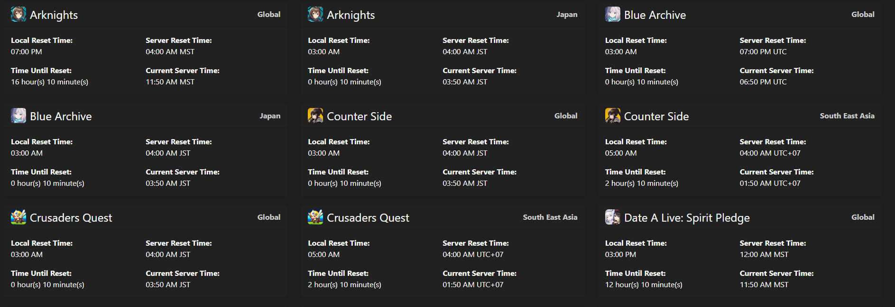
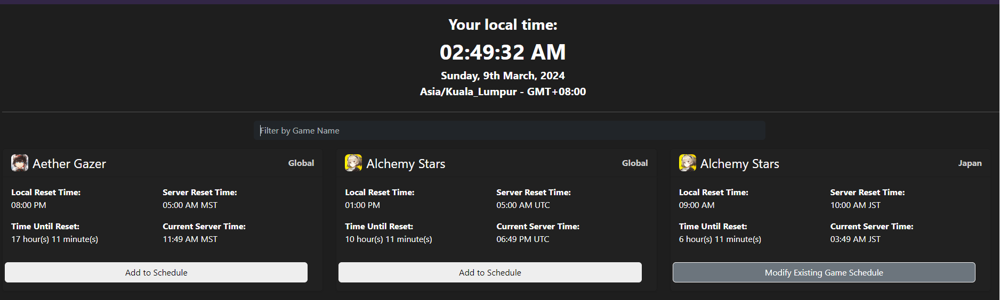
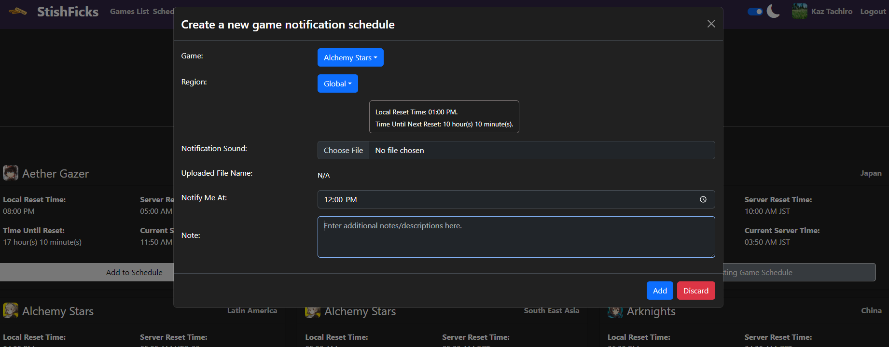

## Game Master Mock App
Ever feel **bogged down** from trying to remember which game's dailies would reset at when? This app is here to help you look through when each game's dailies/weeklies will reset, as well as schedule an alarm to remind you to do them!

## Code style
React.js v18.2.0/Javascript ES

[](https://github.com/facebook/react)
[](https://github.com/standard/standard)

## Frameworks
**Built with**:-
- [React](https://react.dev/)
- [Vite](https://vitejs.dev/)
- [Redux](https://redux.js.org/)
- [Redux JS Toolkit](https://redux-toolkit.js.org/)
- [Router v6](https://reactrouter.com/en/main)

## Features
It's a pet project for funsies and explorative purposes, which combines the UI layouts from other pet projects as well as an official website. Thus, its Unique Selling Point (USP) would probably be it being centralized (Both **Cicerake** and **Caliphdev**'s web page functionalities in one).

## Installation
- Fork or download the zipped project. Currently it's packaged as is (the source code) without any compressions/encryptions.
- Ensure that your system has [NPM](https://nodejs.org/en) installed in your system before proceeding forward.
- Open the project's base folder with your desired IDE. (**VSC/VS2019/etc.**)
- Run the command, `npm i` or `npm install` to install all the required packages specified in <b>package.json</b>.
- To test the project on the development environment, simply run `npm run dev`.

## How to deploy?
- [Development] Run the command, `npm run dev` to have it work on your local host environment. (E.g. `http://localhost:[Your Port Number]`)
- [Production - GitHub Pages] Run `npm run deploy` from the **KT/GitHub-Pages** branch and switch your deployment branch to `gh-pages`. (Under your GitHub Repository's `Settings -> Pages -> Build and Deployment -> Branch`)
- [Production - other deployment websites] You may be required to run the `npm run build` command to get the **dist** folder. Follow the instructions of your preferred website.

## How to use?
- Guests can access the **Games List** page to find out when their favourite game's reset times are.

- Registered & Logged users on the other hand, can assign an alarm which will ring their desired audio file, on a daily basis.



## Built-in Dummy Users
- As the project was created purely on front-end (with no back-end database), all newly created users are cached into local storage while listed below are the cached default users stored within the project files:

```
// Located in "src/data/users.js". Use the "email" and "password" fields respectively to log in.
    {
        email: "aa@aa.com",
        password: "111111",
        firstName: "Kaz",
        lastName: "Tachiro"
    },
    {
        email: "bb@bb.com",
        password: "222222",
        firstName: "Itsu",
        lastName: "Majitsu"
    },
    {
        email: "cc@cc.com",
        password: "333333",
        firstName: "John",
        lastName: "McClaine"
    },
    {
        email: "admin@admin.com",
        password: "123456",
        firstName: "admin",
        lastName: "The Meanie"
    }
```

## Current Active Deployments
1. [Vercel](https://ssb-m2-11b-todo-list-app-v5-assessment.vercel.app/)
2. [GitHub Pages](https://ktleow93584.github.io/SSB-M2-11b-TODO-List-App-v5-Assessment/)

## Contributions
- As this project was created with the intention of pushing my capabilities to the limits within the assessment timeframe, future support for more games' inclusivity would be limited to what's already featured in [Cicerake's website](https://cicerakes.github.io/Game-Time-Master/).
- With that said, any developers seeing potential in this project and/or want to help make it better, may feel free to fork this project or submit a pull request. 🦾

## Credits
Big shoutout to the following websites, as the project's UI and layouts were either <b>heavily inspired</b> and/or <b>replicated</b> from them:
1. [Game Master by Cicerakes](https://github.com/cicerakes/Game-Time-Master)
2. [DLSite (Login Page)](https://login.dlsite.com/login)
3. [Kuru Kuru by Caliphdev](https://github.com/caliphdev/herta_kuru)

## Notes/Addendums
- This project was created as a part of with [Sigma School Bootcamp](https://sigmaschool.co/complete-software-development-programme)'s Module (#2) final assessment requirements.
- Since this project is created fully on front-end (with no live DB), all registered users are stored locally within your browser's cache.

## Pending Features (No promises that it can be fulfilled, however)
- Snooze feature.
- Page Optimizations as per accordance to Google Lighthouse's requirements.
- Background Themes. (More variants as opposed to just dark/light)

## License
MIT © [Leow Kean Tat/Project Kazcade](https://github.com/KTLeow93584)
